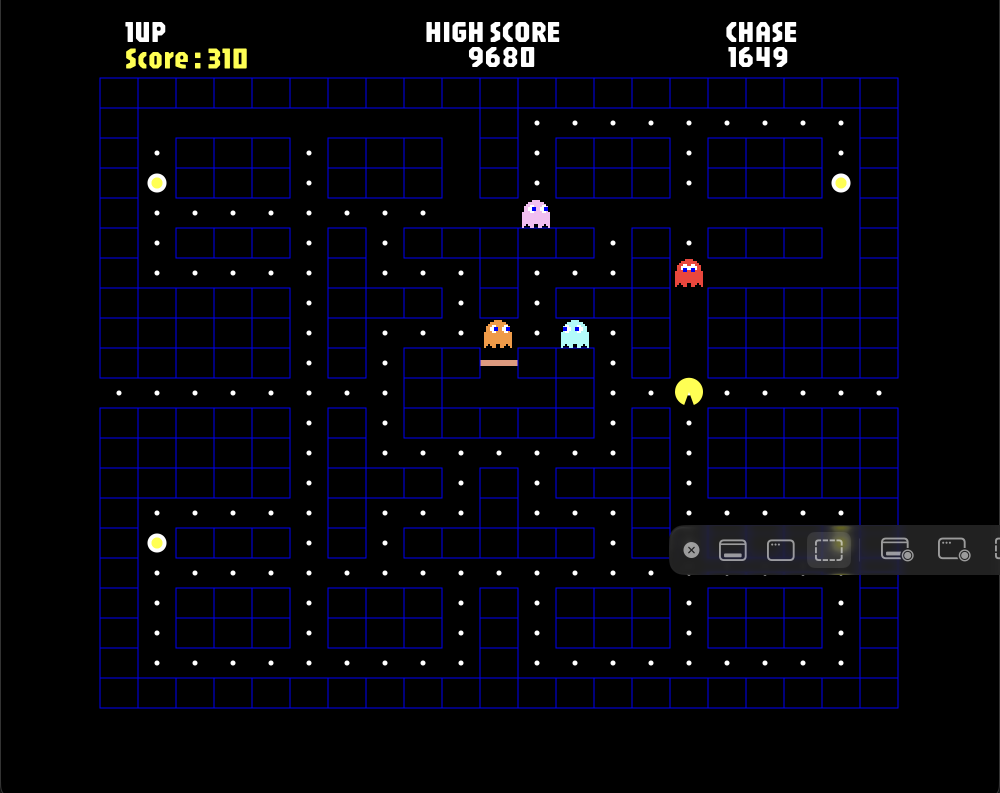
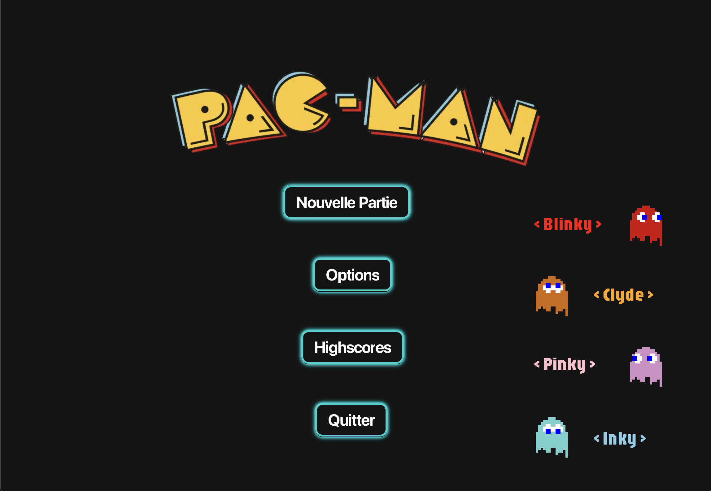

# 🎮 Pacman Game

A JavaFX implementation of the classic Pacman arcade game featuring authentic ghost AI, multiplayer support, and smooth animations




## 📋 Table of Contents

- [About](#about)
- [Features](#features)
- [Installation](#installation)

## 🎯 About

This is a recreation of the classic Pacman arcade game built with JavaFX. The game faithfully recreates the original gameplay mechanics including intelligent ghost AI with distinct personalities, power pellet mechanics, and supports up to 4 players simultaneously.

## ✨ Features

- **Authentic Ghost AI**: Each ghost has unique behavior patterns
  - Blinky (Red): Directly chases Pacman
  - Pinky (Pink): Tries to ambush by targeting ahead of Pacman
  - Inky (Cyan): Uses complex strategy based on Blinky's position
  - Clyde (Orange): Alternates between chasing and fleeing
- **Multiplayer Support**: Play with 1-4 players simultaneously
- **Chase/Scatter Modes**: Ghosts alternate between hunting and patrolling
- **Power Pellets**: Turn the tables and eat ghosts for bonus points
- **High Score System**: Tracks top scores with timestamps
- **Smooth Animations**: Interpolated movement and mouth animations
- **Lives System**: 3 lives per player
- **Custom Controls**: Configurable keyboard controls for each player


### Screenshots




## 🚀 Installation

### Prerequisites

- Java JDK 8 or higher
- JavaFX SDK (if not bundled with your JDK)

### Setup Instructions

1. Clone the repository:
```bash
git clone https://github.com/300n/Pacman.git
cd Pacman
```

2. Compile and run:
```bash
javac MainMenu.java
java MainMenu
```

---

